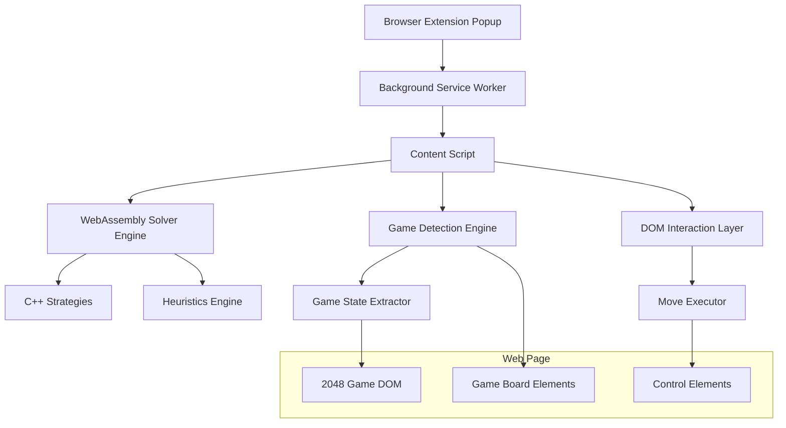

# Design Document

## Overview

The browser extension will be a cross-platform solution that automatically detects and plays 2048-like games on websites using the existing C++ solver algorithms. The system consists of a browser extension frontend, a WebAssembly-compiled solver engine, and a game detection/interaction layer. The extension will inject content scripts into web pages to detect game boards, extract game states, and execute moves while providing a user interface for algorithm selection and real-time monitoring.

## Architecture

### High-Level Architecture



### Lean Runtime Pipeline (Overlay‑First)

In addition to the full MV3/WebExtension architecture above (popup + background + content), we standardize an overlay‑first runtime for rapid, CSP‑resilient operation:

- Loader: bookmarklet or content script (MV3/WebExtension).
- HUD: fixed‑position panel in a Shadow DOM to avoid CSS collisions; draggable, collapsible.
- Detector/Adapters: pluggable modules that read the board from the DOM (site‑specific selectors or a generic 4×4 numeric grid heuristic).
- Driver: sends inputs (keyboard/touch), throttles to ~100–150 ms, and only continues after a confirmed DOM change.
- Solver: begins with a “naive” direction‑bias loop; upgrades to Expectimax (WASM) without touching HUD/driver.

This path is desktop‑first and lets us ship a bookmarklet for quick testing. The extension remains the primary delivery for reliability under restrictive CSP.

### Component Architecture

1. **Extension Core**

   - Popup UI for settings and controls
   - Background service worker for persistence
   - Content script injection system

2. **Game Detection System**

   - DOM pattern recognition
   - Game board identification
   - State extraction algorithms

3. **WebAssembly Solver Engine**

   - Compiled C++ strategies
   - Heuristic evaluation functions
   - Board state management

4. **Interaction Layer**
   - Move execution system
   - Event simulation (touch/keyboard)
   - Game state monitoring

5. **Overlay HUD**
   - Shadow DOM isolation, high z-index
   - Minimal controls: Detect, Auto‑solve, Step, Strategy/priority selector
   - Non‑blocking pointer events to avoid interfering with the game canvas

## Components and Interfaces

### Extension Manifest (Manifest V3)

```json
{
  "manifest_version": 3,
  "name": "2048 AI Solver",
  "version": "1.0.0",
  "permissions": ["activeTab", "storage"],
  "host_permissions": ["<all_urls>"],
  "background": {
    "service_worker": "background.js"
  },
  "content_scripts": [
    {
      "matches": ["<all_urls>"],
      "js": ["content.js"],
      "run_at": "document_idle"
    }
  ],
  "action": {
    "default_popup": "popup.html"
  },
  "web_accessible_resources": [
    {
      "resources": ["solver.wasm", "solver.js"],
      "matches": ["<all_urls>"]
    }
  ]
}
```

### Core Interfaces

#### ISolverEngine

```typescript
interface ISolverEngine {
  initialize(): Promise<void>;
  setStrategy(strategy: StrategyType, params: StrategyParams): void;
  pickMove(board: bigint): number; // 0=left, 1=up, 2=right, 3=down
  evaluateBoard(board: bigint): number;
  reset(): void;
}
```

#### IGameDetector

```typescript
interface IGameDetector {
  detectGame(): GameInfo | null;
  extractBoardState(): bigint | null;
  isGameActive(): boolean;
  isGameEnded(): boolean;
}

interface GameInfo {
  boardElement: HTMLElement;
  controlElements: {
    tiles: HTMLElement[];
    scoreElement?: HTMLElement;
    restartButton?: HTMLElement;
  };
  gameType: "2048" | "threes" | "custom";
}
```

#### Adapter Contract (Overlay Runtime)

For most sites a simple adapter interface is sufficient and avoids over‑engineering. This complements the detector/executor interfaces above.

```ts
/** Adapter contract usable in JS or TS */
export type Dir = 0 | 1 | 2 | 3; // 0=Up,1=Right,2=Down,3=Left
export interface Adapter {
  canAttach(): boolean;                 // quick site check
  readBoard(): number[][] | null;       // 4×4 matrix, 0 for empty
  sendMove(dir: Dir): void;             // dispatches keyboard and/or touch events
}
```

#### IMoveExecutor

```typescript
interface IMoveExecutor {
  executeMove(direction: Direction): Promise<boolean>;
  waitForMoveCompletion(): Promise<void>;
  simulateTouch(direction: Direction): void;
  simulateKeyboard(direction: Direction): void;
}
```

### WebAssembly Integration

The existing C++ solver will be compiled to WebAssembly using Emscripten with the following modifications:

#### Enhanced Export Bindings

```cpp
// Enhanced export_players.cpp
EMSCRIPTEN_BINDINGS(enhanced_players) {
    // Existing strategy bindings...

    // Board utility functions
    function("boardFromArray", &boardFromArray);
    function("arrayFromBoard", &arrayFromBoard);
    function("isValidMove", &isValidMove);
    function("makeMove", &makeMove);

    // Game state utilities
    function("getScore", &getScore);
    function("getMaxTile", &getMaxTile);
    function("isGameOver", &isGameOver);

    // Strategy factory
    function("createStrategy", &createStrategy);
    function("destroyStrategy", &destroyStrategy);
}
```

#### Board State Conversion

```cpp
// Utility functions for JS-WASM communication
board_t boardFromArray(const std::vector<int>& tiles) {
    board_t board = 0;
    for (int i = 0; i < 16; ++i) {
        board |= static_cast<board_t>(tiles[i]) << (i * 4);
    }
    return board;
}

std::vector<int> arrayFromBoard(board_t board) {
    std::vector<int> tiles(16);
    for (int i = 0; i < 16; ++i) {
        tiles[i] = (board >> (i * 4)) & 0xF;
    }
    return tiles;
}
```

## Data Models

### Game State Model

```typescript
interface GameState {
  board: number[][]; // 4x4 grid of tile values (0 for empty)
  score: number;
  maxTile: number;
  moveCount: number;
  isGameOver: boolean;
  isWon: boolean;
}
```

### Driver Configuration (Overlay Runtime)

```ts
interface DriverConfig {
  throttleMs?: number;           // default 100–150ms
  directionBias?: 0|1|2|3;       // preferred first direction (keep max tile corner)
  pauseWhenHidden?: boolean;     // default true
  domChangeTimeoutMs?: number;   // post‑move wait before checking DOM
}
```

### Strategy Configuration Model

```typescript
interface StrategyConfig {
  type: "expectimax" | "monte_carlo" | "minimax" | "random_trials";
  params: {
    depth?: number;
    trials?: number;
    probability?: number;
    heuristic?: HeuristicType;
  };
}

type HeuristicType =
  | "score"
  | "merge"
  | "corner"
  | "wall_gap"
  | "full_wall"
  | "strict_wall"
  | "skewed_corner"
  | "monotonicity";
```

### Extension State Model

```typescript
interface ExtensionState {
  isActive: boolean;
  isPaused: boolean;
  currentStrategy: StrategyConfig;
  gameStats: {
    gamesPlayed: number;
    averageScore: number;
    maxTileReached: number;
    winRate: number;
  };
  detectedGames: GameInfo[];
}
```

## Error Handling

### Error Categories

1. **Detection Errors**

   - Game not found on page
   - Unsupported game variant
   - DOM structure changes

2. **Solver Errors**

   - WebAssembly loading failures
   - Invalid board states
   - Strategy initialization errors

3. **Execution Errors**
   - Move execution failures
   - Network timeouts
   - Permission denied errors

### Error Recovery Strategies

```typescript
class ErrorHandler {
  handleDetectionError(error: DetectionError): void {
    switch (error.type) {
      case "GAME_NOT_FOUND":
        this.retryDetection();
        break;
      case "UNSUPPORTED_VARIANT":
        this.showUnsupportedMessage();
        break;
      case "DOM_CHANGED":
        this.reinitializeDetection();
        break;
    }
  }

  handleSolverError(error: SolverError): void {
    switch (error.type) {
      case "WASM_LOAD_FAILED":
        this.fallbackToSimpleStrategy(); // naive overlay strategy remains available
        break;
      case "INVALID_BOARD":
        this.resetGameState();
        break;
    }
  }
}
```

## Runtime Loop & Change Detection

- Maintain a lightweight loop that:
  - Reads current board (hash/flatten matrix).
  - Tries a prioritized direction order (e.g., keep max tile in a corner).
  - Waits `domChangeTimeoutMs` and re‑reads board; if changed, accept; otherwise try next direction.
  - If no move changes the board, randomize a direction to escape traps.
- Throttle attempts to ~100–150 ms; pause loop when `document.visibilityState !== 'visible'`.
- Prefer a `MutationObserver` to flag tile container changes as a wakeup signal.

## CSP & Bookmarklets

- Primary distribution is extension builds (MV3/WebExtension/Safari) to bypass restrictive CSP.
- Provide a minified IIFE bundle for use as a bookmarklet; document an inline, self‑contained variant when remote loads are blocked.

## Mobile Platform Support

- Firefox for Android: ship as a WebExtension; parity with desktop content script expected.
- iOS Safari: package the same WebExtension via Xcode’s Safari Web Extension tooling.
- Chrome on Android/iOS: no extension support; document as unsupported. Alternatives: bookmarklet (limited) or a minimal in‑app WebView/WKWebView “mini‑browser”.

## Testing Strategy

### Unit Testing

- WebAssembly solver integration tests
- Game detection algorithm tests
- Move execution simulation tests
- Strategy parameter validation tests

### Integration Testing

- End-to-end automation on known 2048 sites
- Cross-browser compatibility testing
- Mobile browser functionality testing
- Performance benchmarking against native C++ solver

### Test Game Sites

1. https://mitchgu.github.io/GetMIT/ (primary target)
2. https://play2048.co/
3. https://2048game.com/
4. Mobile-optimized variants

### Performance Testing

- Move calculation latency (target: <100ms)
- Memory usage monitoring
- WebAssembly vs native performance comparison
- Battery impact on mobile devices

## Security Considerations

### Content Security Policy

- Restrict WebAssembly execution to extension context
- Validate all DOM interactions
- Sanitize extracted game data

### Permission Model

- Minimal required permissions (activeTab, storage)
- No network requests to external servers
- Local-only data storage

### Overlay Safety

- Namescope all CSS in Shadow DOM; set high z‑index and non‑blocking pointer‑events.
- Verify DOM changes before queuing new moves to avoid busy‑looping.

### Code Injection Prevention

- Sandboxed WebAssembly execution
- Validated move execution
- Protected extension state

## Deployment Strategy

### Build Process

1. Compile C++ solver to WebAssembly
2. Bundle overlay runtime into two outputs: a minified IIFE (`2048-hud.min.js`) for the bookmarklet and a content script (`content.js`) for MV3/WebExtension
3. Bundle extension files (manifest, popup/background if used)
4. Generate platform-specific packages (Chromium MV3, Firefox WebExtension, Safari Web Extension)
5. Automated testing pipeline and CI builds (produce bookmarklet file + extension zips on every push)

### Distribution

- Chrome Web Store (Chrome/Edge)
- Firefox Add-ons (Firefox)
- Safari Extensions (Safari)
- Manual installation for development
- Direct bookmarklet hosting via static hosting/CDN

### Update Mechanism

- Automatic extension updates via browser stores
- Backward compatibility for saved settings
- Migration scripts for data format changes
